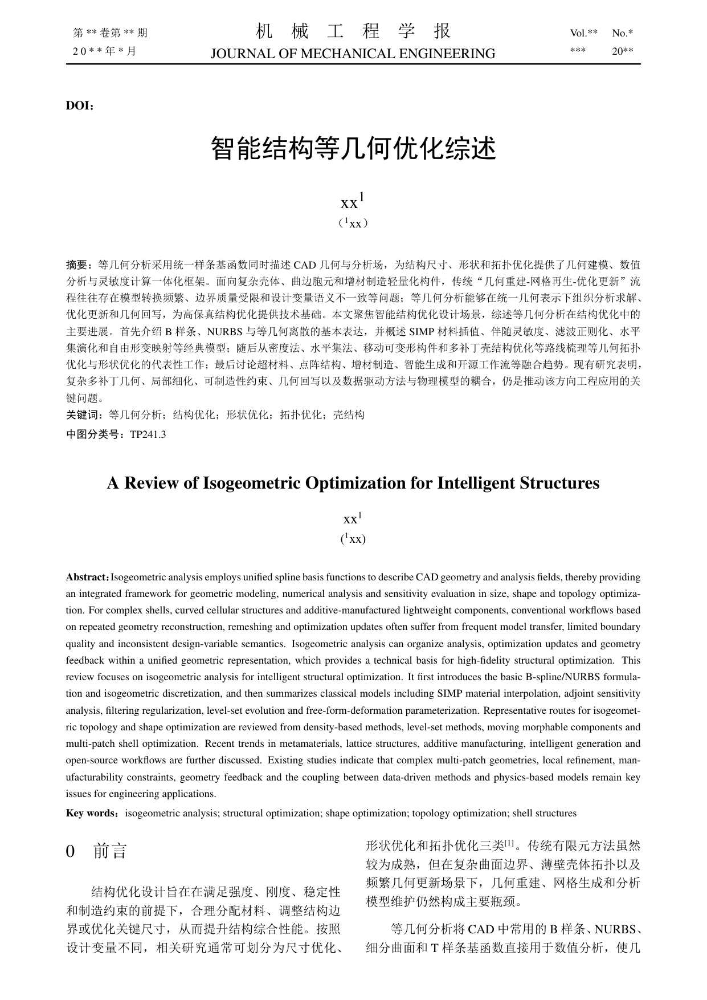
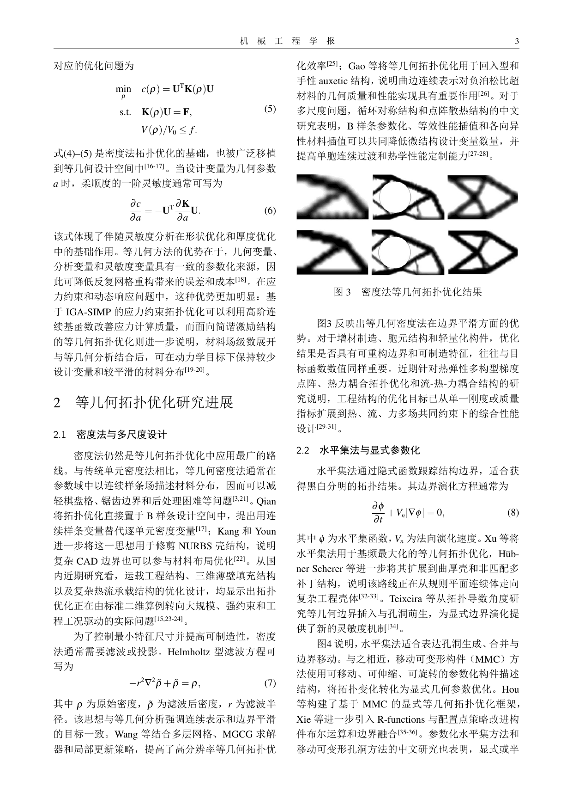
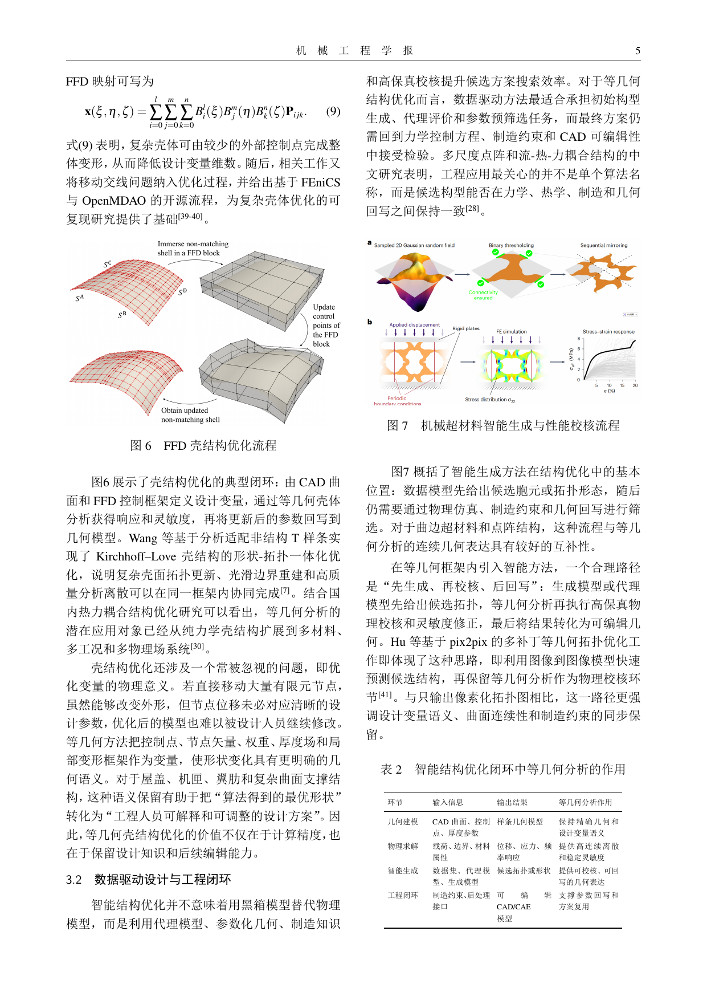
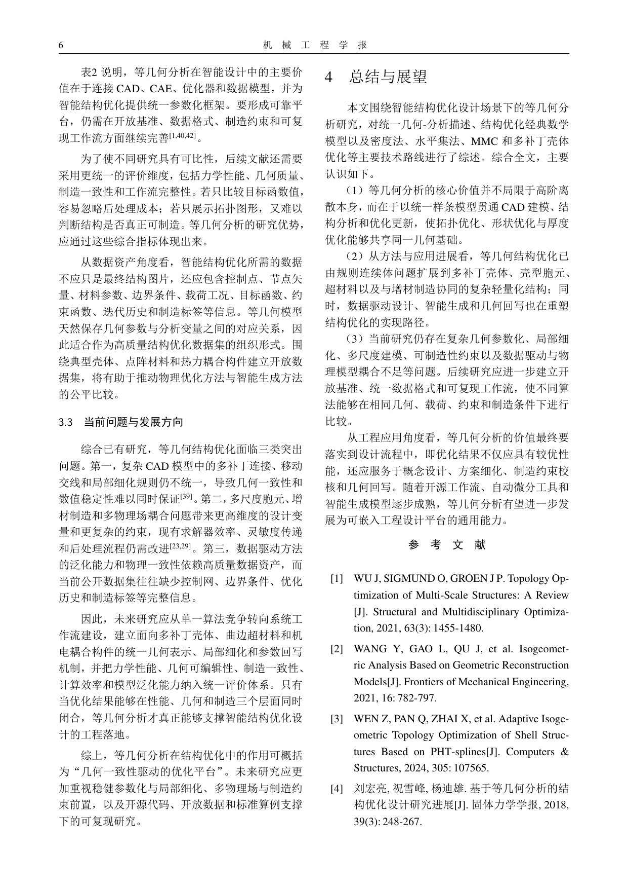
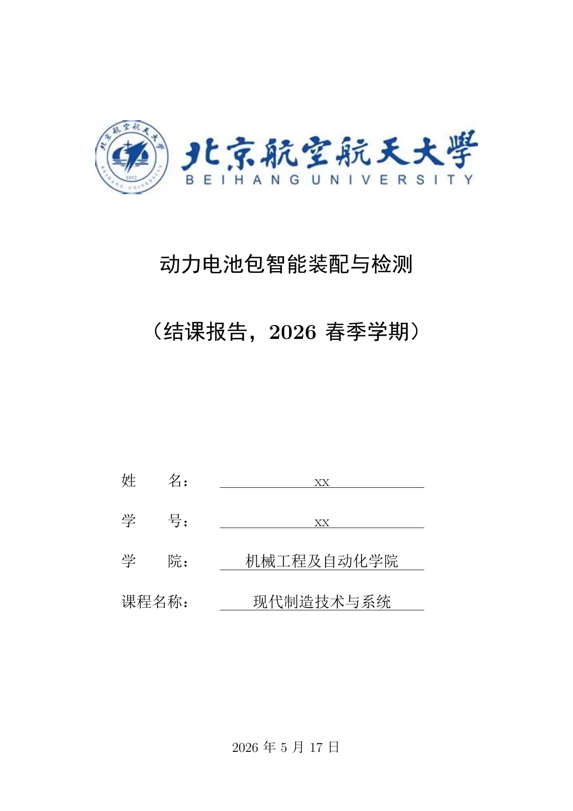
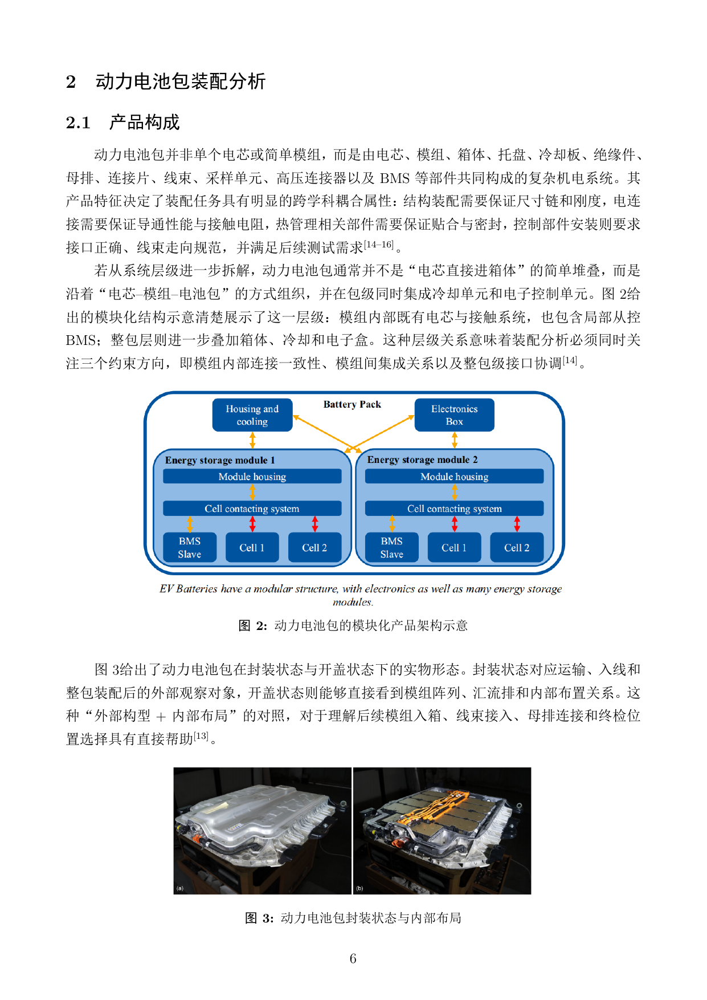
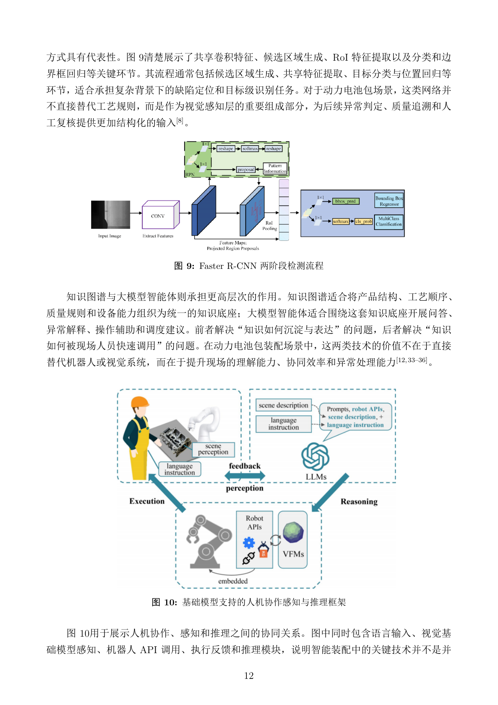
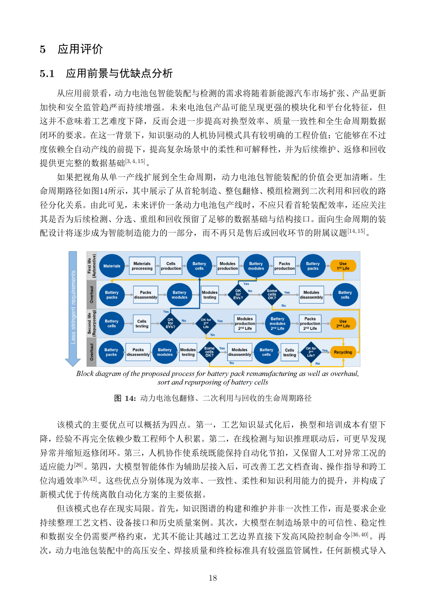

# homework_skill

这是一个面向“课程论文 / 文献综述 / 小型学术写作任务”的组合式 skill 仓库。 
写作工作流：

```text
先看要求
  ↓
定题与搭框架
  ↓
先下载真实论文
  ↓
再写正文
  ↓
最后做引用、图表、摘要和全文质检
```

## 适合谁用

- 想快速搭一个综述论文项目的人
- 需要按固定流程完成课程论文、短篇综述、调研类报告的人
- 希望把“选题、检索、写作、润色、检查”连成一条稳定流水线的人

## 最快开始

1. 先选模板，再复制为你的项目目录：  
   - 中文期刊 / 机械工程学报风格：`skill/academic-review-workflow/assets/project-template/`
   - IEEE / 单栏课程报告风格：`skill/academic-review-workflow/assets/project-template-ieee/`
2. 先改新项目里的 `README.md`，写清题目、字数、页数、引用数、图片要求。  
3. 使用 `academic-review-workflow` 作为总控 skill：
   - 先用 `academic-paper-strategist` 定题、检索、搭框架
   - 再把真实论文下载到 `refs/papers/`
   - 然后用 `academic-paper-composer` 按框架写作
   - 最后做全文润色与规则检查
4. 完成后运行检查脚本：

```bash
python skill/academic-review-workflow/scripts/check_review_project.py <你的项目目录>
```

这个脚本负责机械检查；主题一致性、摘要是否贴合正文、结论结构是否自然，仍需要人工复核。

## 成品预览

### CJME 风格

| 首页 | 方法与公式 |
| --- | --- |
|  |  |

| 智能融合趋势 | 总结与展望 |
| --- | --- |
|  |  |

### IEEE 风格

| 封面 | 产品与任务分析 |
| --- | --- |
|  |  |

| 智能技术应用 | 新模式章节 |
| --- | --- |
|  |  |

## 仓库结构

```text
homework_skill/
├─ README.md
├─ skill/                         # 可复用能力层
│  ├─ academic-review-workflow/   # 本仓库的总控 skill
│  ├─ academic_paper_skills/      # 选题与成文辅助
│  ├─ humanizer_zh/               # 中文润色
│  └─ drawio-skill/               # 图示辅助
├─ templates/                     # 底层模板
│  └─ cjme-latex/                 # 机械工程学报 LaTeX 模板
├─ examples/                      # 已完成示例，用来看最终效果
│  ├─ cjme/
│  └─ ieee/
├─ deploy.bat
└─ deploy.sh
```

## 你真正需要记住的规则

- 写作前先向 `refs/papers/` 下载论文，且至少包含 10 篇相关领域顶会或顶刊论文
- `refs/papers/` 中的论文必须全部在正文中引用
- 总文献数约 42 篇，中英文比例约 `3:7`，且全部为近 5 年文献
- 每篇参考文献最多引用 2 次
- 每张图必须且只能被引用 1 次
- 标题层级统一用 `1.`、`1.1`、`1.1.1`
- 数学公式必须来自教材或论文
- “总结与展望 / 结论”采用总—分—总结构，中间用 `（1）（2）（3）`
- 不要写“从课程内容看”“课程要求表明”这类话

## 每个目录各做什么

- `skill/academic-review-workflow/`：真正的主流程入口
- `skill/academic-review-workflow/assets/project-template/`：CJME 风格新项目起点
- `skill/academic-review-workflow/assets/project-template-ieee/`：IEEE 风格新项目起点
- `examples/`：已完成示例，用来看成品长什么样
- `templates/cjme-latex/`：底层排版模板，通常不直接从这里开始写
- `<你的项目>/refs/notes/paper_index.md`：论文白名单账本，决定哪些文献可以被引用

## 推荐工作顺序

1. 复制干净模板  
2. 修改 README  
3. 定题与检索  
4. 下载论文  
5. 写摘要、引言、正文、结论  
6. 补图、补公式  
7. 做最终检查  
